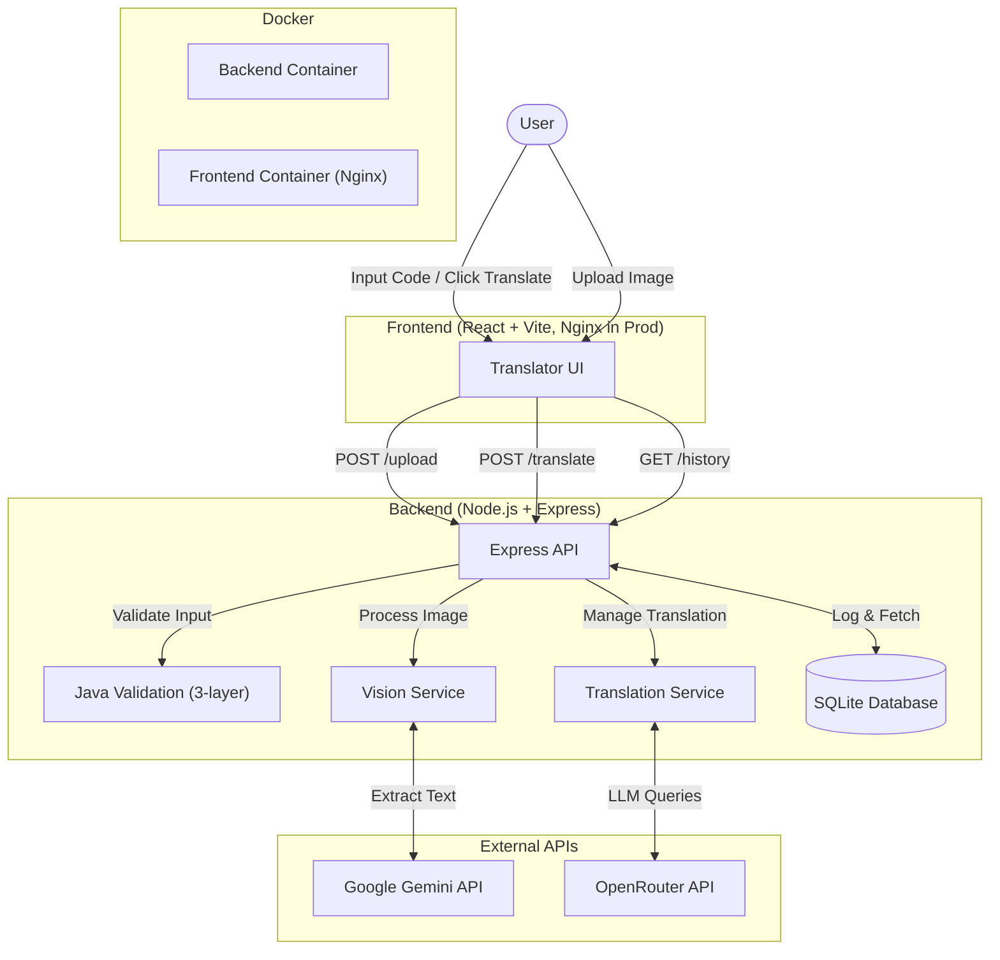

# Codemorpher Architecture

Codemorpher is a full-stack web application designed to translate Java code into various other programming languages, generate debugging steps, and provide algorithm outlines. 

## System Overview

The system operates using a standard client-server architecture:

1. **Frontend (Client)**: Built with React and Vite, utilizing Tailwind CSS v4. In production, it is served via Nginx configured with reverse proxies to the backend APIs, focusing on a responsive and split-view design for side-by-side code input and translation output.
2. **Backend (Server)**: A Node.js and Express server that handles incoming translation requests, processes images for code extraction, and interacts with external APIs. It includes modular architecture separating vision processing and translation engines.
3. **Validation**: A three-layer Java input validator ensures only valid Java code is accepted—rejecting non-Java languages (Python, JavaScript, etc.), invalid syntax, and non-code input at both translate and image-upload endpoints.
4. **Database**: SQLite (`better-sqlite3`) is used for local logging of successful translations and errors to maintain a history.
5. **Containerization**: Both the frontend and backend include `Dockerfile`s optimized for multi-stage building and running as unprivileged users (Alpine Linux base).
6. **External Services**: 
   - **OpenRouter API**: Used as the primary engine for translating code, generating debugging steps, and algorithm outlines.
   - **Google Gemini API**: Utilized for parsing images and extracting Java code.

## Component Breakdown

### Frontend
- **Framework**: React + Vite for fast development and optimized builds.
- **Styling**: Tailwind CSS for rapid, utility-first styling.
- **Key Dependencies**: 
  - `react-syntax-highlighter` (Prism) for rendering code with syntax highlighting.
  - `react-router-dom` for application routing (Translator vs. History view).
- **Core Components & Hooks**:
  - `TranslatorPage`: The main split-view interface.
  - `CodeInput` & `CodeOutput`: Handles user code entry and displaying results.
  - `LanguagePicker`: Selection for the target translation language.
  - `useTranslator`: Custom hook managing the translation state, loading, error handling, and validation error codes.
  - `useImageUpload`: Custom hook managing the image upload state and extraction workflow (with validation error passthrough).

### Backend
- **Framework**: Node.js + Express.
- **Data Persistence**: `better-sqlite3` is used to maintain a lightweight, local database (`codemorpher.db`) for tracking user requests.
- **Key Modules**:
  - `/validation`: Contains `javaValidator.js` implementing three-layer input validation—Layer 1 (sanity checks), Layer 2 (language detection via `program-language-detector`), Layer 3 (syntax validation via `tree-sitter-java`).
  - `/translators`: Contains `translator.js` which employs a provider pattern to abstract translation engines (e.g., OpenRouter or Mock providers). It also houses `useOpenRouter.js` for OpenRouter-specific logic.
  - `/vision`: Contains `geminiImageParser.js` which handles the integration with Google's Gemini API for prompt-based image-to-text extraction.
  - `/db`: Contains `database.js` for schema initialization and `logService.js` for logging events.
- **Routing**: 
  - Express handles simple REST API endpoints (`/translate`, `/upload`, `/history`).

## Data Flow
1. **Manual Input**: User types Java code into the frontend.
   - Or **Image Input**: User uploads an image, the frontend sends it to `/upload`, the backend uses Gemini to extract text, validates the extracted code is Java, and returns the Java code to the frontend (or a validation error if not Java).
2. User selects a target language and clicks "Translate".
3. Frontend sends a `POST /translate` request with `javaCode` and `targetLanguage`.
4. Backend runs three-layer validation on `javaCode`. If invalid (wrong language, bad syntax, etc.), returns `400` with a user-friendly error message.
5. If valid, backend triggers the `useOpenRouter` module to request translation, debugging steps, and an algorithm outline.
6. Once OpenRouter responds, the backend logs the translation to SQLite.
7. The JSON payload is returned to the frontend.
8. Frontend updates its state and displays the translated code, debugging steps, and algorithm to the user. Validation errors are shown inline with a dismissible message.
